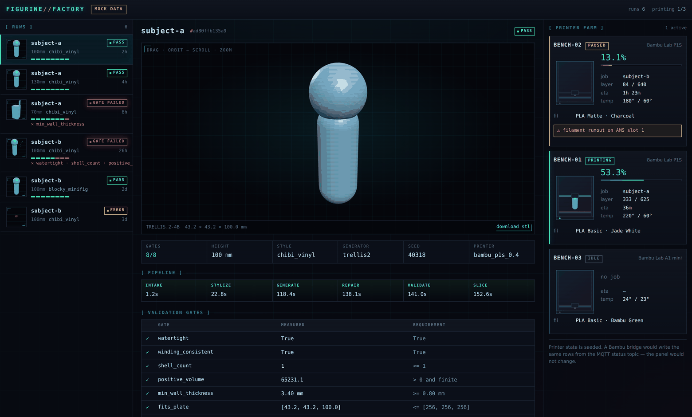
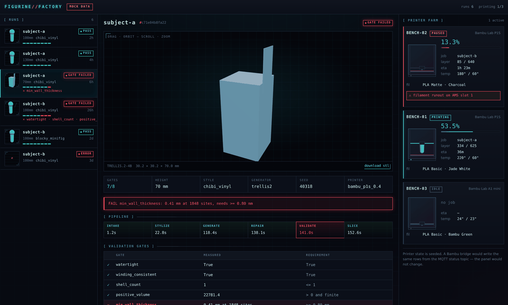
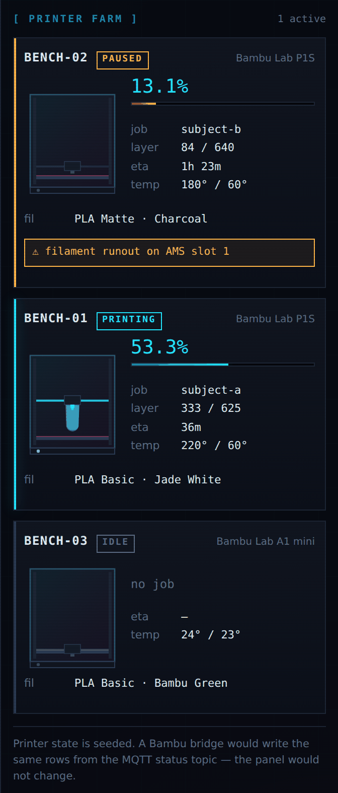
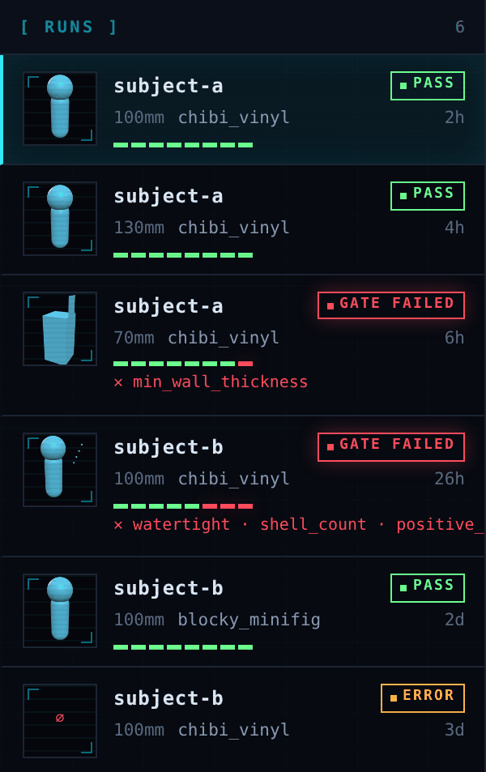

<div align="center">

# Figurine Factory

**Photos of a family member → a print-ready 3D figurine on a Bambu printer, in one command.**

The output is the pipeline, not one model. Success is the *second* and *third* figurine
each taking under **30 minutes** of my time, with **zero** manual mesh editing.



<sub>The local dashboard. Runs on the left, the object centre, the printer farm on the right.<br>
Real screenshots of the running app — the <b>run and printer data is seeded</b>, which the UI labels as <code>MOCK DATA</code>.</sub>

</div>

---

## The problem

AI image-to-3D tools produce meshes that look fine on screen and **fail in the slicer**:
non-manifold geometry, floating shells, sub-0.8 mm walls, no flat base. Fixing each one by
hand in Blender costs 45–90 minutes and never gets faster, because every model breaks
differently.

**So the value here is the repair and validation stage, not the generation stage.**
Generators are swappable backends chosen by config. The part that earns its keep is the
code that refuses to hand you a bad STL.

```
photos/ ──▶ stylize ──▶ generate ──▶ repair ──▶ validate ──▶ sliced .3mf
             │            │            │           │
        named preset  TRELLIS.2    manifold,    8 gates,
        (a set        (local, MIT) shells,      hard-fail
         matches)                  base, scale  with a reason
```

## A run that fails

A gate failure is the screen this project exists for. It names the gate, the measured
value, the threshold, and the fix — and **writes nothing**.



The same shape of failure from the CLI, on a known-bad fixture:

```
$ figurine repair tests/fixtures/thin_wall.stl --height 20
2 validation gate(s) failed:
  FAIL shell_count: measured 2, needs <= 1
       fix: lower repair.min_shell_volume_frac to drop more debris, or the base union failed
  FAIL min_wall_thickness: measured 0.06 mm at 1848 sites, needs >= 0.80 mm
       fix: scale the figurine taller with --height, or use a style preset with chunkier
            extremities (thicker limbs, fused hair)
No mesh was written. A bad STL is worse than no STL.
```

Exit codes: `0` pass · `2` validation failure · `3` generation failure · `4` slicer failure.

## The printer farm

<table>
<tr>
<td width="46%" valign="top">



</td>
<td valign="top">

Each printer is **drawn, not described**. The gantry rides up as the job progresses and
the model is revealed bottom-up by an SVG clip rectangle — the picture *is* the progress
bar, not a decoration beside one.

Progress is **derived from elapsed time** against the job estimate rather than stored. A
stored percentage goes stale the moment nothing updates it; a derived one keeps moving on
its own.

Printers sort by **how much attention they need**, so the paused machine with a filament
runout never hides underneath a running one.

A Bambu MQTT bridge would write the same rows and this panel would not change.

</td>
</tr>
</table>

## Run history

<table>
<tr>
<td valign="top">

Every run gets a live mesh preview, a tick per validation gate, and the names of whatever
failed — before you click anything.

The previews share **one** offscreen WebGL renderer and cache their output. Six live
canvases would mean six contexts against a browser cap of roughly sixteen, and the main
viewer would start losing its own.

A run that was refused shows `∅`: no mesh was written, so there is nothing to preview.

</td>
<td width="38%" valign="top">



</td>
</tr>
</table>

## Privacy — non-negotiable

These are photos of my child.

- Generation runs **locally on TRELLIS.2** (MIT) — decided, see [D1](docs/decisions.md).
  Needs a 24 GB NVIDIA GPU on Linux; `figurine doctor` checks before you count on it.
- **No child photos in this repo, in git history, or in any test fixture.** Enforced by
  `.gitignore`, a pre-commit hook (`scripts/check_no_photos.py`), and procedurally
  generated test fixtures. Photos live in untracked `work/`.
- Hosted generators **refuse to run** without an explicit `--allow-upload` flag, used only
  with synthetic or public-domain faces during the bake-off. `tests/test_privacy.py`
  holds that guard.
- Any hosted assets are deleted afterwards and logged in
  [`bakeoff/deletion_log.md`](bakeoff/deletion_log.md).

## Quick start

```bash
make dev            # editable install + dev deps + pre-commit hook
make fixtures       # generate synthetic test meshes
make test           # 30 tests
figurine doctor     # check this machine against what the pipeline needs
```

Repair and validate a mesh from any generator — this works today, no GPU needed:

```bash
figurine repair path/to/raw.glb --height 100     # STL + manifest + report
figurine validate path/to/raw.glb                # score a raw mesh; the bake-off metric
```

The dashboard:

```bash
cd webui
bun install         # Bun 1.4+
bun run seed        # sample runs, so the UI works before the generator exists
bun run build
bun run api         # http://127.0.0.1:8757
```

`bun run api` serves the built app and the API on one origin. For frontend work run
`bun run api` and `bun run ui` in two shells — Vite proxies `/api` to the Bun server.
Publish a real run into the UI with `figurine publish out/<run_id>`.

The UI binds to **127.0.0.1 only** — this machine holds the photos and the meshes. It is
dark-only by design: the neon reads against near-black and nowhere else, and colour
carries state and chrome, never body text.

## Status

| Milestone | State |
| --- | --- |
| 1. Generator bake-off | not started — see [`bakeoff/`](bakeoff/) |
| 2. Manual end-to-end figurine | not started |
| 3. Repair automated | **working** — `figurine repair` runs today on any mesh |
| 4. Validation gates | **working** — 8 gates, hard-fail with a named fix |
| 5. One-command run | generator chosen (TRELLIS.2); stylize + generate still to wire |
| 6. Second subject, no manual editing | not started |
| 7. README with comparison table + photos | comparison table pending milestone 1 |

Repair and validation were built first, against synthetic fixtures, because they are the
value and they do not depend on which generator wins.

**Not yet real:** the stylize and generate stages. Generation needs a 24 GB GPU that CI
does not have, so it is not covered by the test suite — said plainly rather than implying
coverage that does not exist.

## Generator comparison

Empty until milestone 1. Vendor claims — Meshy's 97% figurine slicer pass rate, Tripo's
auto-repair — are hypotheses to test on my own inputs, not facts to build on.

| backend | slicer pass | watertight | repair min | likeness | style | total |
| --- | --- | --- | --- | --- | --- | --- |
| _pending_ | | | | | | |

## Layout

```
prd.md                          the spec
docs/decisions.md               D1 local vs hosted · D2 single vs multi-view · D3 resin vs FDM
configs/default.yaml            every threshold, in one place
configs/presets/styles/         named style presets — this is why a set matches
configs/printers/               nozzle, plate, Bambu Studio preset JSONs
src/figurine_factory/
  meshops/                      stats, repair operations, wall-thickness raycasting
  stages/                       intake, stylize, generate, repair, validate, slice
  manifest.py                   everything needed to reproduce a run
  web/schema.sql                one schema, shared by the Python writer and Bun reader
  web/sqlite_sink.py            publishes a run manifest into that database
webui/                          Bun + React + Vite + CSS Modules dashboard
  server/                       Bun.serve API, bun:sqlite queries, printer farm, seed
  src/                          React components
bakeoff/                        milestone 1 harness, scorecard, deletion log
tests/fixtures/make_fixtures.py procedural broken meshes — never a photograph
scripts/check_no_photos.py      pre-commit privacy guard
```

## Printed results

Empty until milestone 2.

---

MIT licensed. Full spec: [`prd.md`](prd.md). Decisions: [`docs/decisions.md`](docs/decisions.md).
